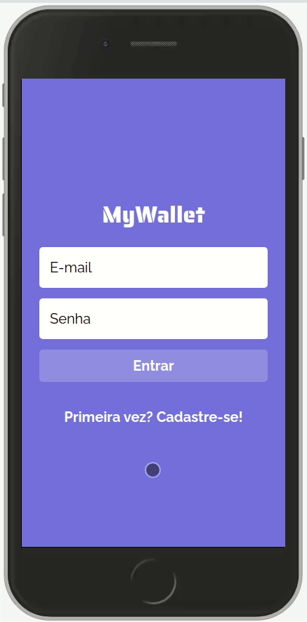

# My Wallet

An easy to use financial manager. Track your revenues and expenses to learn how you spend your money and know all the time how much you have.

<p align="center" >
  
</p>

Try it out now at https://my-wallet-xi.vercel.app/

## About

This is an web application with which lots of people can manage their own expenses and revenues. Below are the implemented features:

- Sign Up
- Login
- List all financial events for a user
- Add expense
- Add revenue
- Show pie chart for expenses

By using this app any user can learn how they've been using their money and always keep track of your balance.

## Technologies

The following tools and frameworks were used in the construction of the project:<br>

<p>
  
  
  
  
  
  

</p>

## How to run

1. Clone this repository
2. Install dependencies

```bash
npm i
```

3. Configure the .env file using the .env.example file

4. Run the app

```bash
npm start
```

5. You can optionally build the project running

```bash
npm run build
```

6. Finally access http://localhost:3000 on your favorite browser

## Back-end

The back-end of this application was deployed on https://mywalletback.herokuapp.com and can be seen at https://github.com/andeaquino/myWallet-back
